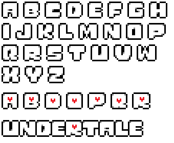

# PinkSoulLibrary Remake
> [!WARNING]  
> ## If you are using CYF v0.6.6 LTS2, then download v0.8 LTS2 compatible.
> ## If you are using CYF v0.6.6 LTS3, then download the LTS3 v0.8 version.
> ###### Don't know how to install CYF v0.6.6 LTS3 version?  [Download it here](https://github.com/RhenaudTheLukark/CreateYourFrisk/releases/tag/v0.6.6.3)

### More updates soon!

 

# The Pink Soul Library Remake
**"Pink Soul : Defend yourself...in rhythm ! (Kinda)" - u/Kayakazan, 2015.**
- This library is a remake of the first Pink Soul library created back in __2015__. The original owner is **u/Kayakazan**, so all the credits should be given to him.

## Why did i make this library?
- I made it due to the original library being removed from its uploaded page, so i decided to recreate it based on the [video](https://www.youtube.com/watch?v=wGoT2A1yR6w) that was left on youtube about it.

# Preview (v0.8 - Small Arena)
[Preview](https://jp222343.github.io/PinkSoulLibrary/assets/preview/video-v0.8-smallarena.mp4)

# Preview (v0.8 - Big Arena)
[Preview](https://jp222343.github.io/PinkSoulLibrary/assets/preview/video-v0.8-bigarena.mp4)

---

# How to use the library
###### If you don't know how to install libraries, i recommend searching before doing these.

- 1 - Download the library on the releases tab. (Make sure to download the latest version)
- 2 - Extract the zip file, open the **"PinkSoulLibrary"** folder and put all the other folders on the desired place of your mod (Lua, Audio and Sprites) - Make sure the sub folders are also on the correct place.
- 3 - Follow the next instructions:

## Inserting the library on a new wave
If you want to put the library on a new wave, follow these instructions:


- 1 - Import the library by placing this at the top of your wave script:
```local PinkSoulLibrary = require("Libraries/pinksoul")```
If you get an error, it might be because the library isn't on the correct folder (Libraries) or because you renamed the Library lua file and/or folder.

- 2 **(Variables)** (Optional) - Here are the custom variables you can add to the library:

  - ##### Cooldown warning (true or false)
  ```PinkSoulLibrary.cooldownwarning(true)``` - Use **true** to enable (Default) or **false** to disable the cooldown warning.
  
  - ##### Arena size (1 or 2)
  ```PinkSoulLibrary.arenasize(1)``` - Arena size. 1 is the default (Small arena), 2 is wider (Big arena).


- **3 - Call the library by inserting this line somewhere in your script (DON'T INSERT IT INSIDE AN Update() FUNCTION):**
  ```PinkSoulLibrary.PinkSoul()``` -- Parameters (Optional): ```mainy, lettery, maxrandomspeed, delay```
    - The Parameters are explained [here](https://github.com/jp222343/PinkSoulLibrary/blob/main/README.md#the-attack-function-1) (Scroll down to find them)
 
- 4 - Add these blocks to make the library work correctly, or else you will get an **error**.

```
-- DO NOT Remove this. If you need to use the Update() function, just add your code under the 'PinkSoulLibrary.Update()' line.
function Update()
    PinkSoulLibrary.Update()
end

-- DO NOT Remove this. If you need to use the OnHit() function, just add your code under the 'PinkSoulLibrary.OnHit(bullet)' line.
function OnHit(bullet)
    PinkSoulLibrary.OnHit(bullet)
end
```
**After that, you're ready to go! But before that, read the next instructions:**

## The attack function
- In the library example waves folder (if you're using it), you'll see a file called ``pinkattack.lua``, and it has many important functions.

  ### The attack function
  The attack function is the main function, and you can insert __optional__ **parameters** on it. The parameters needs to be put in this order:
  ```PinkSoulLibrary.PinkSoul(mainy, lettery, maxrandomspeed, delay)```

  **Here is the explanation of the parameters:**

| Parameter  | Explanation |
| ------------- | ------------- |
| mainy  | It's the **y** level of the Main Bullet (The pink thingy) - Default value is __70__  |
| lettery  | This is the **y** level of where the letters are going to spawn - Default value is __200__  |
| maxrandomspeed | The letters spawn at different speeds, going from **1** to **maxrandomspeed** - Default value is __3__ |
| delay | Delay for the letter spawning. (⚠️ **IT'S NOT IN SECONDS**) - Default value is __50__ (recommended) |

# How to change the key letters

- **If you want to edit the letters, you'll also have to make the sprites. But don't worry, i left the entire font in the __'Sprites'__ folder.**
> [!WARNING]  
> The letters sprites size needs to be **50x50**!


If you are lazy to look for it, here it is:


**Don't forget to edit the Library's code if you want to change the keys, i marked all the lines that you have to edit to make your custom keys work!**
__If you don't know the key ID's, check the [Unity KeyCode documentation](https://docs.unity3d.com/2018.4/Documentation/ScriptReference/KeyCode.html), it contains all the Key IDs that you need.__

If you want to use an alphabet letter, make sure to **CAPITALIZE IT**, example: ``Input.GetKey("A")``
  - If you put it in lower case it won't work.

---

## Here is the full wave code if you are lazy (Make sure you have the library installed) (You won't need this if you have the library's default wave code):
```
-- Pink Soul remake
-- Example attack
-- By: jp222343 Credits to u/Kayakazan

-- ✍️ If you want to edit the letters, you'll also have to make the sprites. But don't worry, i left the entire font in the 'Sprites' folder.
-- The letter sprite image size has to be 50x50.

--[[

!!!!!!!!!!!!!!!!!!!!!!
PinkSoulLibrary V0.8 FOR CYF V0.6.6 >>LTS3<< (Latest)
!!!!!!!!!!!!!!!!!!!!!!

]]


local PinkSoulLibrary = require("Libraries/pinksoul")

-- Enable or Disable the cooldown warning (This won't disable the cooldown, only the warning.):
PinkSoulLibrary.cooldownwarning(true) -- Cooldown warning, use true to enable and false to disable. (This won't disable the cooldown, only the warning.)

PinkSoulLibrary.arenasize(1) -- Arena size. 1 is the default, 2 is wider.

-- This is how you call the attack | Optional Parameters: mainy, lettery, maxrandomspeed, delay
-- They're all explained in <https://github.com/jp222343/PinkSoulLibrary>, but if you don't want to use them you can leave it blank and the Library will set the default values.
PinkSoulLibrary.PinkSoul() -- Parameters (Optional): mainy, lettery, maxrandomspeed, delay

--PinkSoulLibrary.PinkSoul(70, 200, 3, 50)     <-- Example Attack with the optional parameters (these are the default values)

-- DO NOT Remove this. If you need to use the Update() function, just add your code under the 'PinkSoulLibrary.Update()' line.
function Update()
    PinkSoulLibrary.Update()
end

-- DO NOT Remove this. If you need to use the OnHit() function, just add your code under the 'PinkSoulLibrary.OnHit(bullet)' line.
function OnHit(bullet)
    PinkSoulLibrary.OnHit(bullet)
end

-- This library's idea is not mine, i just recreated it ;) 
```

### And that's it! Feel free to edit or improve this library.
### All credits go to u/Kayakazan


  
